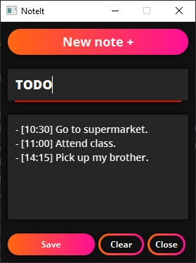

# NoteIt 2

NoteIt is a small app for creating notes and important things to remember 📝

# Tools

- **JavaFX**: JavaFX is a software platform for creating and delivering desktop applications, as well as rich Internet applications that can run across a wide variety of devices. JavaFX is intended to replace Swing as the standard GUI library for Java SE, but both will be included for the foreseeable future.
- **JFoenix**: JFoenix is an open source Java library, that implements Google Material Design using Java components, [Github repo](https://github.com/jfoenixadmin/JFoenix).
- **gradle**: .
- **Intellij Idea**: A powerful IDE for creating Java and Android apps, made by [Jetbrains](https://www.jetbrains.com/)

# Screenshots

The GUI is simple and moder. The note is made small so that many notes can fit on the screen.

# Contributing
Contributions are welcome, feel free to submit bugs, enhancement or refactoring.

----------
**Main author:** [Chems Eddine Senoussi](https://github.com/chemsedd)
